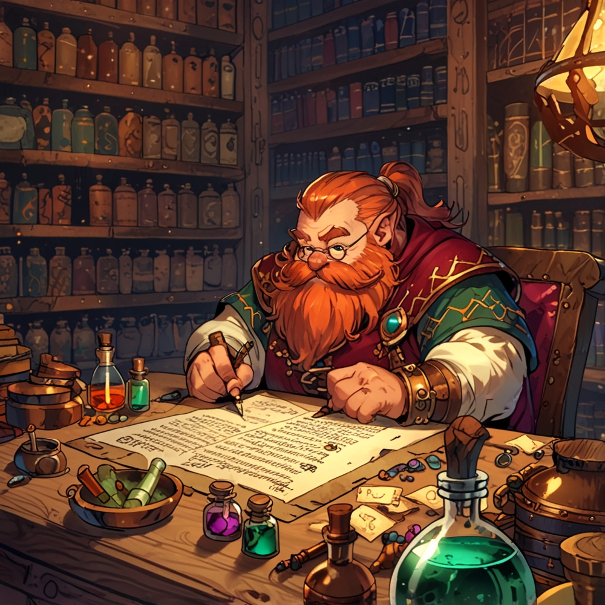
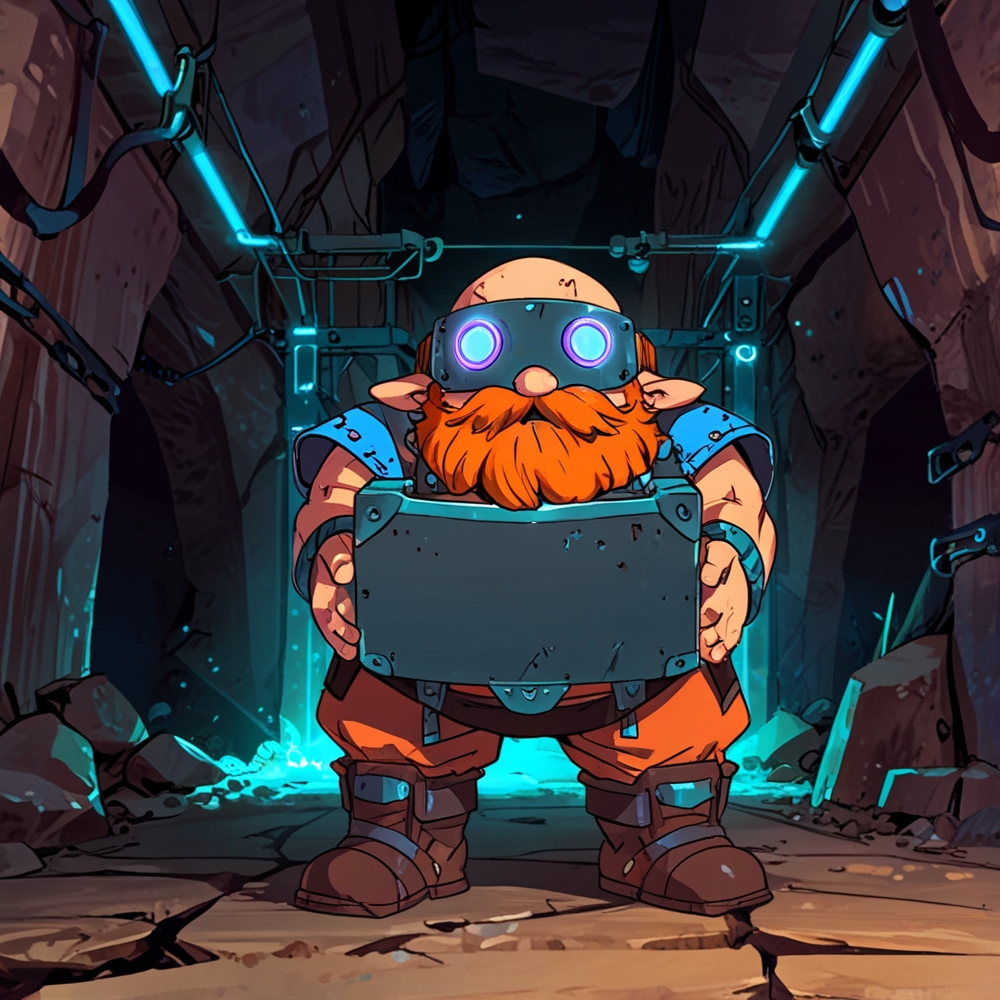
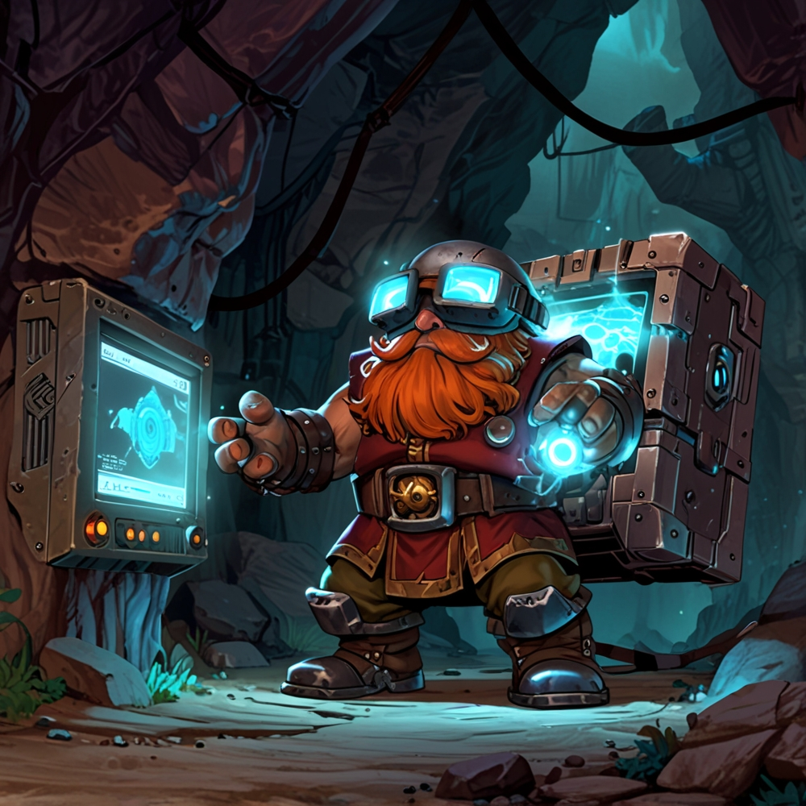

# DwarfVault — Your Personal Text Vault

> **Save. Organize. Discover.** A private, offline Chrome extension for managing text databases with AI-powered semantic search coming in v1.3

<div align="center">
  
</div>

---

## What is DwarfVault?

DwarfVault is a **lightning-fast, privacy-first browser extension** that lets you save, organize, and retrieve text from any website — entirely offline, with no servers involved.

- Save text from any website with a single right-click
- Organize into unlimited custom databases (parent and child vaults)
- Search by keyword or by meaning (v1.3+)
- Export and import for backup and portability
- Zero cloud, 100% local storage

**Designed for:** researchers, data scientists, developers, writers, and anyone who needs a reliable personal knowledge base inside the browser.

<div align="center">
  
</div>

---

## Version Comparison

| Feature | v1.2 (Current) | v1.3 (Coming) | v1.4+ |
|---------|:-:|:-:|:-:|
| Save text to databases | ✅ | ✅ | ✅ |
| Keyword search | ✅ | ✅ | ✅ |
| Export / Import CSV | ✅ | ✅ | ✅ |
| **Semantic search** (AI) | ❌ | ✅ NEW | ✅ |
| **Visual map** (UMAP) | ❌ | ❌ | ✅ NEW |
| **Auto-tagging** (k-NN) | ❌ | ❌ | ✅ NEW |
| **Analytics dashboard** | ❌ | ✅ NEW | ✅ |
| Notification toggle | ✅ | ✅ | ✅ |
| **Native Click** (unlock right-click on Spotify, etc.) | ✅ NEW | ✅ | ✅ |
| Security hardened | ✅ | ✅ | ✅ |

---

## Key Features

### FORGE — Database Management

- Create parent and child databases to organize knowledge hierarchically
- Rename vaults on the fly
- Delete entire vaults with a single action
- Link favorite databases to the context menu for instant access

### TRADE — Import / Export

- Export a single database as **CSV** (compatible with spreadsheet tools)
- Export a full vault with all child databases as **JSON**
- Import CSV to restore or merge databases
- Full backup and restore support at any time

### RELICS — Entry Management

- **Keyword Search** — find entries by text content or index number
- **Semantic Search** (v1.3+) — find entries by meaning, not just exact words
- Edit entries inline without leaving the popup
- Copy to clipboard with one click
- View the source URL and favicon from the original page
- Delete entries with a confirmation step to prevent accidents

### Glyph Vault — Character Selector

- Quick access to over 100 characters and symbols
- Copy any glyph to the clipboard instantly
- Integrated directly into the FORGE panel

### TABLES — Database Viewer

- Full table view of all databases and entries
- Columns: index, text, source URL, favicon
- Sortable and searchable

### Smart Notifications

- Toggle system notifications on or off from SETTINGS
- Receive confirmation when text is saved
- Mute all notifications with a single click

### Native Click — Context Menu Unlock

Some websites (Spotify, Notion, and similar) override the browser's right-click menu with their own, blocking access to the native menu — and to DwarfVault's "Save to Vault" entry. The Native Click toggle restores the browser's default context menu on the active tab without reloading the page.

- Toggle from SETTINGS: `Native Click OFF` / `Native Click ON`
- Affects only the active tab — does not leak to other sites
- Deactivating restores the site's custom menu instantly, no reload required
- Automatically disabled on restricted pages (`chrome://`, Web Store, PDF files)

---

## Quick Start

### Installation — Developer Mode

```
1. Clone or download this repository
2. Navigate to chrome://extensions/
3. Enable "Developer mode" (top right)
4. Click "Load unpacked"
5. Select the DwarfVault folder
6. The extension icon appears in your toolbar
```

**Keyboard shortcut:** `Ctrl+Y` (Windows / Linux) or `Cmd+Y` (Mac) to open the popup.

---

## Usage Guide

### 1. Create Your First Database

```
FORGE → NEW VAULT (Parent) → Enter a name → Confirm
```

The database is stored locally. You can now save text to it.

### 2. Save Text from Any Website

**Method A — Right-click context menu**
```
1. Select any text on a webpage
2. Right-click → "The Dwarf's Vault" → Choose a database
3. Text, URL, and favicon are saved automatically
```

**Method B — Popup**
```
1. Open the popup with Ctrl+Y
2. Select a database in FORGE
3. Paste your text and confirm
```

### 3. Search and Manage Entries

**Keyword search:**
```
RELICS → Type a word or index number → Results appear instantly
```

**Semantic search (v1.3+):**
```
RELICS → Semantic tab → "machine learning" →
Returns: "deep learning", "neural networks", etc. (by meaning)
```

### 4. Export and Backup

**Single database (CSV):**
```
FORGE → TRADE → EXPORT CSV
```

**Full vault with child databases (JSON):**
```
FORGE → TRADE → EXPORT Full Vault
```

**Restore from backup:**
```
FORGE → TRADE → IMPORT CSV  or  IMPORT Full Vault
```

### 5. View All Data

Click **TABLES** in the navigation bar to see a full table view of all databases and entries with sortable columns.

---

## Semantic Search — How It Works

Instead of matching exact keywords, semantic search understands the **meaning** behind words.

**Example:**
```
Saved text:  "Python machine learning libraries like TensorFlow"
Search query: "deep learning frameworks"

Result: match found — 87% similarity
```

Under the hood:
- The AI converts text into meaning vectors (384 dimensions)
- Vectors are compared using cosine similarity
- Results are ranked by relevance from 0 to 100%
- The model runs entirely offline in the browser after the first download (~22 MB, cached locally)

First search takes 2–10 seconds for model initialization; subsequent searches run in under one second.

---

## Project Structure

```
DwarfVault/
├── manifest.json              Extension config and permissions
├── index.html                 Main popup UI
├── popup.js                   Popup logic and database CRUD
├── background.js              Service worker, context menus
├── View Board.html            Table view of all databases
├── History.html               Tutorial page
├── scripts/
│   ├── db.js                  IndexedDB interface
│   ├── security.js            XSS prevention and input validation
│   ├── notifications.js       System notification module
│   ├── contextUnlock.js       Native Click — context menu unlock
│   ├── ml.js                  AI wrapper (Phase 1)
│   ├── ml-worker.js           AI computation in a Web Worker
│   ├── Butons.js              Button interaction handlers
│   └── Menu.js                Navigation menu logic
├── icons/                     Extension icons (16 / 48 / 128 px)
├── fonts/                     Custom typefaces
├── image/                     UI and artwork assets
├── styles.css                 Main stylesheet
├── styles Board.css           Table view styles
├── styles History.css         Tutorial styles
└── emojis.json                Glyph Vault character database
```

---

## Security and Privacy

<div align="center">
  
</div>

### Your Data is Always Yours

- **100% offline** — nothing is sent to any server
- **Client-side only** — IndexedDB stores everything in your local browser
- **No tracking** — no analytics, no advertising, no telemetry
- **Open source** — the full codebase is available for audit

### Security Hardening (v1.2+)

- **CSP enabled** — `script-src 'self'` blocks injection attacks
- **XSS protection** — all URLs and database names are validated before use
- **Import validation** — CSV and JSON imports are sanitized on load
- **Favicon safety** — only verified image URLs are rendered
- **No `eval()`** — fully Manifest V3 compliant

---

## Technical Details

<div align="center">
  
</div>

| Component | Technology |
|-----------|-----------|
| **Storage** | IndexedDB (local, persistent) |
| **UI** | Vanilla JS, HTML5, CSS3 |
| **Architecture** | Chrome Manifest V3 |
| **Threading** | Web Workers (non-blocking AI computation) |
| **AI** (v1.3+) | Transformers.js + MiniLM-L6-v2 |
| **Search performance** | under 1 second after model load |

### Permissions

| Permission | Purpose |
|------------|---------|
| `contextMenus` | Right-click save and quick-access menu |
| `storage` | Persist user preferences |
| `notifications` | System toast notifications |
| `tabs`, `activeTab` | Read current page URL and favicon |
| `clipboardWrite` | Copy text to clipboard |
| `scripting` | Content script injection (Native Click, text capture) |

---

## Roadmap

### v1.2 — Current

- Core CRUD operations (create, read, update, delete)
- CSV import and export
- Context menu integration with parent/child vault structure
- Security hardening (CSP, XSS validation, favicon safety)
- Notification toggle
- Native Click toggle — unlock right-click on sites with custom context menus
- 100% offline operation

### v1.3 — Next (May 2026)

- Semantic search with AI embeddings (MiniLM + Transformers.js)
- Analytics dashboard (TF-IDF, word frequency)
- Notification system improvements
- UI polish

### v1.4+ — Planned

- UMAP visualization — explore your data in 2D space
- Auto-tagging with k-NN classifier
- Duplicate detection using MinHash + LSH
- Performance optimizations
- Firefox version exploration

See the full roadmap: [ROADMAP_v1.3-v1.7.md](ROADMAP_v1.3-v1.7.md)

---

## Documentation

| Document | Purpose |
|----------|---------|
| [README.md](README.md) | Overview and quick start |
| [ROADMAP_v1.3-v1.7.md](ROADMAP_v1.3-v1.7.md) | 7-phase AI roadmap with architecture |
| [PHASE_1_INTEGRATION.md](PHASE_1_INTEGRATION.md) | Step-by-step guide for v1.3 |
| [PHASE_1_CODE_EXAMPLES.md](PHASE_1_CODE_EXAMPLES.md) | Code snippets for v1.3 integration |
| [README_FASE_1.md](README_FASE_1.md) | Summary in Spanish |

---

## FAQ

**Is my data safe?**
All data stays in your browser's IndexedDB. Nothing leaves your device.

**Can I sync across devices?**
Not in v1.2. Use Export/Import to move data between devices.

**How much data can I store?**
Typically 50 MB or more depending on browser settings. Most users store thousands of entries without issue.

**Will semantic search work offline?**
Yes, after the first model download. The model (~22 MB) is cached locally by the browser.

**Is this available on Firefox or Safari?**
Not yet. DwarfVault currently supports Chrome and Edge (Manifest V3). A Firefox port is planned for v1.4.

**Do you collect any data?**
No. DwarfVault is completely local, anonymous, and open source.

**How do I report a bug?**
Open an issue on GitHub or contact: WarpigglyTech@gmail.com

---

## Packaging for Distribution

When building the extension ZIP for the Chrome Web Store, exclude development files:

```
Exclude:
  ROADMAP_*.md
  PHASE_*.md
  README_*.md
  .git/
  .gitignore
  *.jsonl

Include:
  manifest.json
  index.html, View Board.html, History.html
  background.js, popup.js, Viewboard.js
  scripts/
  styles*.css
  icons/, fonts/, image/
  emojis.json
```

Target size: approximately 500 KB zipped.

---

## Development

### Clone and Set Up

```bash
git clone https://github.com/DearDeivy/DwarfVault.git
cd DwarfVault
# Load in Chrome: chrome://extensions → Developer Mode → Load Unpacked
```

### Build for Production

```bash
zip -r DwarfVault-v1.2.zip . \
  -x "*.md" "*.git*" "*.jsonl" ".DS_Store"
```

---

## Contributing

Found a bug or want to propose a feature?

1. Fork the repository
2. Create a branch: `git checkout -b feature/your-feature`
3. Commit your changes: `git commit -m "Add feature"`
4. Push: `git push origin feature/your-feature`
5. Open a pull request

---

## License

MIT License — free for personal and commercial use.

---

## Credits

**Developer:** David Salazar Saldarriaga (DearDeivy / Warpiggly)
**Contact:** WarpigglyTech@gmail.com
**License:** MIT

**Libraries and resources used:**
- Transformers.js (HuggingFace) — in-browser AI models
- Righteous Font — custom typography
- Unicode Consortium — character database

---

## Support

- Bug reports: open an issue on GitHub
- Questions: WarpigglyTech@gmail.com
- If this project is useful to you, consider starring the repository.

---

<div align="center">

**Made by DearDeivy**

*DwarfVault — Save. Organize. Discover.*

[GitHub](https://github.com/DearDeivy/DwarfVault) &nbsp;·&nbsp; [Email](mailto:WarpigglyTech@gmail.com) &nbsp;·&nbsp; [Version 1.2](https://github.com/DearDeivy/DwarfVault/releases)

</div>
